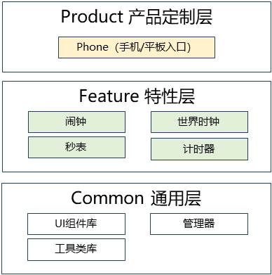

# 时钟应用

## 简介
`Clock` 是 OpenHarmony 系统中的基础时钟应用，提供闹钟、秒表、倒计时和世界时钟四大核心功能。该应用采用 ArkTS 语言开发，基于 OpenHarmony Stage 模型，支持 Phone 和 Tablet 多种设备形态，具备响应式布局、多设备适配和无障碍支持等特性。

Clock 包含以下常用功能：

* **闹钟功能**：支持创建、编辑、删除闹钟，支持重复设置（工作日、周末、自定义等），提供贪睡功能和多种铃声选择。
* **世界时钟**：支持添加多个城市的时区时钟，提供全球主要城市的时间显示，支持添加和删除城市。
* **秒表功能**：支持计时的开始、暂停、复位，支持计次功能（记录多个时间点），提供精确的毫秒级计时显示。
* **计时器功能**：支持设置倒计时时间，提供预设时间选项，支持开始、暂停、复位操作，倒计时结束时通过通知提醒用户。
* **多设备适配**：支持手机、平板等多种设备形态，自动适配不同屏幕尺寸。
* **国际化支持**：支持简体中文、繁体中文、英文、藏文、维吾尔文等多种语言。

## 系统架构

<div align="center">
  
  <br>
  <b>图 1</b> 时钟应用系统架构图
</div>

### 模块功能说明

整体架构采用模块化设计，划分为产品层、特性层和公共层。

* **产品定制层 (Product Layer)**
  * **Phone Entry**: 手机/平板设备入口模块，负责应用的 Ability 生命周期管理、页面路由和设备特定适配。

* **特性层 (Feature Layer)**
  * **闹钟**: 包含闹钟卡片、闹钟管理页面、全屏闹钟界面、闹钟服务管理器等核心组件。
  * **世界时钟**: 提供世界时钟列表和卡片组件，支持城市管理和时区显示。
  * **秒表**: 提供秒表表盘 UI、计时控制器和计次功能。
  * **计时器**: 包含模拟计时器、时间选择器、倒计时控制器和倒计时管理器。

* **公共层 (Common Layer)**
  * **组件库**: 提供时钟表盘、数字时钟、添加按钮、卡片、对话框、标题栏等通用 UI 组件。
  * **管理器**: 包含数据库管理、闹钟管理、计时器管理、资源管理、状态管理、音频管理等核心业务逻辑。
  * **工具类库**: 提供时间格式化、事件上报、通知管理、WantAgent 等基础功能。

### 关键交互流程

#### 闹钟触发流程

1. **闹钟设置**: 用户通过闹钟管理页面创建或编辑闹钟，设置时间和重复规则。
2. **数据存储**: 通过 `AlarmManager` 将闹钟信息保存到关系型数据库。
3. **时间监听**: 系统监听时间变化，当到达闹钟设置时间时触发闹钟。
4. **闹钟服务**: `AlarmServiceManager` 接收闹钟触发事件，启动闹钟服务。
5. **音频播放**: 通过 `AudioManager` 和 `SoundPool` 播放闹钟铃声。
6. **界面显示**: 显示全屏闹钟界面或横幅通知，用户可以停止或贪睡。
7. **贪睡处理**: 如果用户选择贪睡，通过 `SnoozeManager` 计算下次触发时间。

#### 秒表计时流程

1. **开始计时**: 用户点击开始按钮，控制器启动计时器。
2. **时间更新**: 计时器每 10 毫秒更新一次显示时间。
3. **计次记录**: 用户点击计次按钮，记录当前时间点到计次列表。
4. **暂停计时**: 用户点击暂停按钮，计时器停止更新。
5. **复位操作**: 用户点击复位按钮，清除所有计次记录，重置时间为零。

#### 计时器流程

1. **时间设置**: 用户通过时间选择器设置倒计时时间。
2. **开始倒计时**: 用户点击开始按钮，倒计时管理器启动系统计时器。
3. **时间更新**: 每秒更新剩余时间显示，支持后台运行。
4. **时间结束**: 倒计时结束时，通过通知提醒用户。
5. **全屏提醒**: 显示全屏提醒界面，用户可以停止或重新开始。

## 目录

项目目录结构如下：

```
applications_clock-master/              # 时钟应用根目录
├── AppScope/                           # 应用全局配置
│   └── resources/                      # 全局资源文件
│       ├── base/                       # 基础资源
│       ├── zh_CN/                      # 简体中文资源
│       ├── en/                         # 英文资源
│       └── dark/                       # 深色主题资源
├── common/                             # 公共 HAR 模块
│   ├── src/main/ets/
│   │   ├── components/                 # 通用组件
│   │   │   ├── Clock/                  # 时钟组件
│   │   │   │   ├── ClockHands.ets     # 时钟指针
│   │   │   │   ├── Dial.ets           # 表盘
│   │   │   │   ├── DigitalClock.ets   # 数字时钟
│   │   │   │   └── Scale.ets          # 刻度
│   │   │   ├── AddButton/             # 添加按钮
│   │   │   ├── Card/                  # 卡片组件
│   │   │   ├── CommonDialog/          # 通用对话框
│   │   │   ├── TitleBar/              # 标题栏
│   │   │   └── RingtoneSelection/     # 铃声选择
│   │   ├── manager/                   # 管理器
│   │   │   ├── DatabaseManager.ets    # 数据库管理基类
│   │   │   ├── AlarmManager.ets       # 闹钟管理
│   │   │   ├── TimerManager.ets       # 计时器管理
│   │   │   ├── ResourceManager.ets    # 资源管理
│   │   │   ├── SoundPool.ets          # 音频播放池
│   │   │   ├── SnoozeManager.ets      # 贪睡管理
│   │   │   └── FormManager.ets        # 卡片管理
│   │   ├── utils/                     # 工具类
│   │   │   ├── TimeUtil.ets          # 时间工具
│   │   │   ├── CommonUtil.ets         # 通用工具
│   │   │   ├── LogUtil.ets            # 日志工具
│   │   │   └── EventReportUtil.ets    # 事件上报
│   │   └── types.ets                  # 类型定义
│   └── build-profile.json5             # 模块构建配置
├── feature/alarmclock/                 # 闹钟功能 HAR 模块
│   ├── src/main/ets/
│   │   ├── components/                # 组件
│   │   │   ├── AlarmCard/            # 闹钟卡片
│   │   │   ├── ArraySlider/          # 时间滑块
│   │   │   └── Form/                 # 卡片组件
│   │   ├── pages/                     # 页面
│   │   │   ├── ManageAlarmClock/     # 闹钟管理
│   │   │   ├── FullScreenAlarm/      # 全屏闹钟
│   │   │   └── BannerAlarm/          # 横幅闹钟
│   │   ├── manager/                   # 管理器
│   │   │   ├── AlarmServiceManager.ets # 闹钟服务管理
│   │   │   └── AudioManager.ets      # 音频管理
│   │   └── utils/                     # 工具类
│   │       └── NotificationUtil.ets  # 通知工具
│   └── build-profile.json5             # 模块构建配置
├── feature/stopwatch/                  # 秒表功能 HAR 模块
│   ├── src/main/ets/
│   │   ├── components/                # 组件
│   │   │   └── StopwatchDial/        # 秒表表盘
│   │   ├── pages 页面
/                     #│   │   │   └── index.ets             # 秒表主页面
│   │   └── SoundManager/              # 音频管理
│   │       └── SoundPoolManager.ets  # 音频池管理
│   └── build-profile.json5             # 模块构建配置
├── feature/timer/                      # 倒计时功能 HAR 模块
│   ├── src/main/ets/
│   │   ├── components/                # 组件
│   │   │   ├── AnalogTimer.ets       # 模拟计时器
│   │   │   ├── TimerPicker.ets       # 时间选择器
│   │   │   └── TimerView.ets         # 计时器视图
│   │   ├── controller/                # 控制器
│   │   │   └── TimerController.ets   # 计时器控制器
│   │   ├── manager/                   # 管理器
│   │   │   ├── timerManager.ets      # 倒计时管理
│   │   │   └── timerAudioPlayer.ets  # 音频播放
│   │   ├── pages/                     # 页面
│   │   │   ├── index.ets             # 倒计时主页面
│   │   │   └── FullScreenTimer/      # 全屏倒计时
│   │   └── utils/                     # 工具类
│   │       └── timerNotificationUtil.ets # 通知工具
│   └── build-profile.json5             # 模块构建配置
├── feature/worldclock/                 # 世界时钟 HAR 模块
│   ├── src/main/ets/
│   │   ├── components/                # 组件
│   │   └── pages/                     # 页面
│   └── build-profile.json5             # 模块构建配置
├── product/phone/                      # 手机/平板 Entry 模块
│   ├── src/main/ets/
│   │   ├── pages/                     # 页面
│   │   │   ├── index.ets             # 主页面
│   │   │   ├── ManageAlarmClock.ets  # 闹钟管理
│   │   │   ├── AddCity.ets           # 添加城市
│   │   │   ├── EditCities.ets        # 编辑城市
│   │   │   └── FullScreenTimer.ets   # 全屏倒计时
│   │   ├── MainAbility/               # 主 Ability
│   │   │   └── MainAbility.ets       # 主 Ability
│   │   ├── ForegroundAbility/         # 前台服务
│   │   │   └── ForegroundAbility.ets
│   │   ├── FullScreenAbility/         # 全屏 Ability
│   │   │   └── FullScreenAbility.ets
│   │   ├── ServiceExtAbility/         # 服务扩展
│   │   │   ├── AlarmService.ets      # 闹钟服务
│   │   │   └── TimerService.ets      # 计时器服务
│   │   ├── IntentAbility/             # 意图处理
│   │   │   ├── CreateAlarm.ets       # 创建闹钟
│   │   │   ├── DeleteAlarm.ets       # 删除闹钟
│   │   │   └── ViewAlarm.ets         # 查看闹钟
│   │   ├── BackupExtension/           # 备份扩展
│   │   │   └── BackupExtension.ets   # 数据备份
│   │   └── subscriber/                # 静态订阅者
│   │       └── AlarmInitSubscriber.ets # 闹钟初始化
│   ├── src/ohosTest/                  # 测试代码
│   │   └── ets/test/                  # 单元测试
│   │       ├── Ability.test.ets      # 能力测试
│   │       └── List.test.ets         # 列表测试
│   └── build-profile.json5             # 模块构建配置
├── oh-package.json5                    # 依赖管理
├── build-profile.json5                 # 项目构建配置
├── hvigorfile.js                       # 构建脚本
└── README_zh.md                        # 中文说明文档
```

## 编译构建

根据不同的目标平台，使用以下命令进行编译：

### 基于 DevEco Studio 构建

1. 在 DevEco Studio 打开项目工程
2. 选择 Build → Build Haps(s)/APP(s) → Build Hap(s)
3. 编译完成后，hap 包会生成在 `build/outputs` 目录下

### 基于命令行构建

**编译时钟应用**

```bash
./build.sh --product-name rk3568 --ccache --build-target clock
```

**安装 hap 包**

```bash
hdc_std install "hap包路径"
```

> **说明：**
> `--product-name`: 产品名称，例如 `rk3568`、`Hi3516DV300` 等。
> `--ccache`: 编译时使用缓存功能。
> `--build-target`: 编译的部件名称。

## 使用说明

### 接口说明

Clock 应用主要使用以下 OpenHarmony API：

**表 1** 主要接口说明

| 接口名称 | 功能描述 |
|---------|---------|
| **@ohos.data.relationalStore** | 关系型数据库，用于存储闹钟和世界时钟数据 |
| **@ohos.data.preferences** | 首选项，用于持久化配置和状态 |
| **@ohos.notification** | 通知管理，用于闹钟和倒计时提醒 |
| **@ohos.multimedia.audio** | 音频管理，用于播放铃声 |
| **@ohos.alarm** | 闹钟管理，用于设置系统闹钟 |
| **@ohos.backgroundTasks** | 后台任务，用于计时器后台运行 |

### 开发步骤

以下演示开发时钟应用的关键步骤：

1. **创建项目结构**：按照模块化设计创建项目目录。
2. **实现数据库管理**：继承 `DatabaseManager` 实现闹钟和世界时钟的数据持久化。
3. **构建 UI 组件**：使用 ArkTS 声明式 UI 构建时钟界面。
4. **实现状态管理**：使用 `@State`、`@StorageLink` 等装饰器管理应用状态。
5. **实现闹钟功能**：使用系统闹钟 API 设置闹钟触发时间。
6. **实现计时功能**：使用系统计时器实现秒表和倒计时。
7. **多设备适配**：使用断点系统实现响应式布局。
8. **添加无障碍支持**：为关键 UI 元素添加无障碍标识。

#### 代码示例

**示例 1：创建闹钟管理页面**

```typescript
@Entry
@Component
struct ManageAlarmClock {
  @State alarmList: Array<AlarmInfo> = []
  private alarmManager: AlarmManager = AlarmManager.getInstance()

  aboutToAppear() {
    this.loadAlarms()
  }

  build() {
    Column() {
      // 标题栏
      TitleBar({ title: '闹钟' })

      // 闹钟列表
      List() {
        ForEach(this.alarmList, (alarm: AlarmInfo) => {
          ListItem() {
            AlarmCard({ alarmInfo: alarm })
          }
        })
      }
      .layoutWeight(1)

      // 添加按钮
      AddButton({ onClick: () => this.addAlarm() })
    }
    .width('100%')
    .height('100%')
  }

  private loadAlarms() {
    this.alarmManager.getAllAlarms((alarms: Array<AlarmInfo>) => {
      this.alarmList = alarms
    })
  }

  private addAlarm() {
    // 跳转到添加闹钟页面
  }
}
```

**示例 2：实现秒表计时功能**

```typescript
@Component
struct Stopwatch {
  @State elapsedTime: number = 0
  @State isRunning: boolean = false
  private timer: number = -1

  build() {
    Column() {
      // 时间显示
      Text(this.formatTime(this.elapsedTime))
        .fontSize(48)
        .fontWeight(FontWeight.Bold)

      // 控制按钮
      Row() {
        Button(this.isRunning ? '暂停' : '开始')
          .onClick(() => this.toggleTimer())

        Button('复位')
          .onClick(() => this.resetTimer())
      }
    }
  }

  private toggleTimer() {
    if (this.isRunning) {
      this.pauseTimer()
    } else {
      this.startTimer()
    }
  }

  private startTimer() {
    this.isRunning = true
    this.timer = setInterval(() => {
      this.elapsedTime += 10
    }, 10)
  }

  private pauseTimer() {
    this.isRunning = false
    clearInterval(this.timer)
  }

  private resetTimer() {
    this.pauseTimer()
    this.elapsedTime = 0
  }

  private formatTime(ms: number): string {
    // 格式化时间显示
    return TimeUtil.timeFormat(ms)
  }
}
```

**示例 3：保存闹钟到数据库**

```typescript
// 使用 AlarmManager 保存闹钟
const alarmManager = AlarmManager.getInstance()

const alarmInfo: AlarmInfo = {
  id: 0,
  hour: 7,
  minute: 30,
  repeatDays: [1, 2, 3, 4, 5], // 工作日
  enabled: true,
  ringtone: 'default_ringtone.mp3',
  label: '工作闹钟'
}

alarmManager.insertAlarm(alarmInfo, (success: boolean) => {
  if (success) {
    LogUtil.info('闹钟保存成功')
  }
})
```

#### 注意事项

* **数据库操作**：`AlarmManager` 继承自 `DatabaseManager`，采用单例模式确保数据库连接的唯一性。
* **状态管理**：使用 `PersistentStorage.persistProp()` 持久化关键状态，确保应用重启后状态保持。
* **闹钟触发**：使用系统闹钟 API `@ohos.alarm` 设置闹钟，确保应用在后台也能正常触发。
* **音频管理**：使用 `SoundPool` 管理音频播放，避免频繁创建和销毁音频播放器。
* **后台运行**：倒计时功能需要使用后台任务管理，确保应用在后台也能正常运行。
* **内存管理**：及时释放不再使用的资源，避免内存泄漏。
* **无障碍支持**：为所有可交互的 UI 元素设置 `id` 和适当的 `accessibilityText`。

## 约束

* **开发环境**
  * **DevEco Studio for OpenHarmony**: 版本号大于 3.0.0.992
  * **SDK 版本**: OpenHarmony SDK API Version 9+
  * **编译 SDK**: API Version 20
  * **兼容 SDK**: API Version 12
  * **语言版本**: ArkTS

* **依赖库**
  * @ohos/hypium: 1.0.6（测试框架）

* **平台限制**
  * 仅支持标准系统上运行
  * 支持 default 和 tablet 设备形态

## 相关仓

[OpenHarmony 应用开发文档](https://gitcode.com/openharmony/docs/blob/master/zh-cn/application-dev/README.md)<br>
[ArkTS 语言指南](https://gitcode.com/openharmony/docs/blob/master/zh-cn/application-dev/arkts-get-started.md)<br>
[Stage 模型开发](https://gitcode.com/openharmony/docs/blob/master/zh-cn/application-dev/ui/arkts-architecture-overview.md)<br>
[UI 开发指南](https://gitcode.com/openharmony/docs/blob/master/zh-cn/application-dev/ui/arkts-ui-development.md)