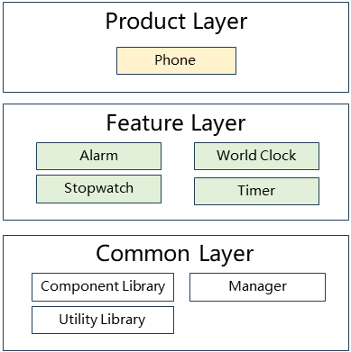

# Clock Application

## Introduction
`Clock` is a basic clock application in the OpenHarmony system, providing four core functions: alarm, stopwatch, countdown timer, and world clock. The application is developed using the ArkTS language, based on the OpenHarmony Stage model, supports multiple device forms including Phone and Tablet, and features responsive layout, multi-device adaptation, and accessibility support.

Clock includes the following common functions:

* **Alarm Function**: Supports creating, editing, and deleting alarms, with repeat settings (workdays, weekends, custom, etc.), snooze function, and multiple ringtone options.
* **World Clock**: Supports adding multiple city time zone clocks, displaying time for major global cities, and adding/removing cities.
* **Stopwatch Function**: Supports start, pause, and reset of timing, with lap function (recording multiple time points) and precise millisecond-level timing display.
* **Timer Function**: Supports setting countdown time, provides preset time options, supports start, pause, and reset operations, and reminds users through notifications when the countdown ends.
* **Multi-Device Adaptation**: Supports multiple device forms such as phones and tablets, automatically adapting to different screen sizes.
* **Internationalization Support**: Supports multiple languages including Simplified Chinese, Traditional Chinese, English, Tibetan, Uyghur, etc.

## System Architecture

<div align="center">
  
  <br>
  <b>图 1</b> Clock Application System Architecture Diagram
</div>

### Module Function Description

The overall architecture adopts a modular design, divided into product layer, feature layer, and common layer.

* **Product Customization Layer (Product Layer)**
  * **Phone Entry**: Phone/tablet device entry module, responsible for application Ability lifecycle management, page routing, and device-specific adaptation.

* **Feature Layer (Feature Layer)**
  * **Alarm**: Contains alarm cards, alarm management page, full-screen alarm interface, alarm service manager, and other core components.
  * **World Clock**: Provides world clock list and card components, supporting city management and time zone display.
  * **Stopwatch**: Provides stopwatch dial UI, timing controller, and lap function.
  * **Timer**: Contains analog timer, time picker, countdown controller, and countdown manager.

* **Common Layer (Common Layer)**
  * **Component Library**: Provides common UI components such as clock dial, digital clock, add button, card, dialog, title bar, etc.
  * **Managers**: Contains core business logic including database management, alarm management, timer management, resource management, state management, audio management, etc.
  * **Utility Library**: Provides basic functions such as time formatting, event reporting, notification management, WantAgent, etc.

### Key Interaction Flows

#### Alarm Trigger Flow

1. **Alarm Setting**: Users create or edit alarms through the alarm management page, setting time and repeat rules.
2. **Data Storage**: Save alarm information to a relational database through `AlarmManager`.
3. **Time Monitoring**: The system monitors time changes and triggers the alarm when the set alarm time is reached.
4. **Alarm Service**: `AlarmServiceManager` receives the alarm trigger event and starts the alarm service.
5. **Audio Playback**: Play alarm ringtones through `AudioManager` and `SoundPool`.
6. **Interface Display**: Display full-screen alarm interface or banner notification, users can stop or snooze.
7. **Snooze Handling**: If the user chooses snooze, calculate the next trigger time through `SnoozeManager`.

#### Stopwatch Timing Flow

1. **Start Timing**: User clicks the start button, and the controller starts the timer.
2. **Time Update**: The timer updates the display time every 10 milliseconds.
3. **Lap Recording**: User clicks the lap button to record the current time point to the lap list.
4. **Pause Timing**: User clicks the pause button, and the timer stops updating.
5. **Reset Operation**: User clicks the reset button to clear all lap records and reset time to zero.

#### Timer Flow

1. **Time Setting**: User sets the countdown time through the time picker.
2. **Start Countdown**: User clicks the start button, and the countdown manager starts the system timer.
3. **Time Update**: Update the remaining time display every second, supporting background operation.
4. **Time End**: When the countdown ends, remind users through notifications.
5. **Full-Screen Reminder**: Display full-screen reminder interface, users can stop or restart.

## Directory

The project directory structure is as follows:

```
applications_clock-master/              # Clock application root directory
├── AppScope/                           # Application global configuration
│   └── resources/                      # Global resource files
│       ├── base/                       # Base resources
│       ├── zh_CN/                      # Simplified Chinese resources
│       ├── en/                         # English resources
│       └── dark/                       # Dark theme resources
├── common/                             # Common HAR module
│   ├── src/main/ets/
│   │   ├── components/                 # Common components
│   │   │   ├── Clock/                  # Clock components
│   │   │   │   ├── ClockHands.ets     # Clock hands
│   │   │   │   ├── Dial.ets           # Dial
│   │   │   │   ├── DigitalClock.ets   # Digital clock
│   │   │   │   └── Scale.ets          # Scale
│   │   │   ├── AddButton/             # Add button
│   │   │   ├── Card/                  # Card component
│   │   │   ├── CommonDialog/          # Common dialog
│   │   │   ├── TitleBar/              # Title bar
│   │   │   └── RingtoneSelection/     # Ringtone selection
│   │   ├── manager/                   # Managers
│   │   │   ├── DatabaseManager.ets    # Database manager base class
│   │   │   ├── AlarmManager.ets       # Alarm management
│   │   │   ├── TimerManager.ets       # Timer management
│   │   │   ├── ResourceManager.ets    # Resource management
│   │   │   ├── SoundPool.ets          # Audio playback pool
│   │   │   ├── SnoozeManager.ets      # Snooze management
│   │   │   └── FormManager.ets        # Form management
│   │   ├── utils/                     # Utility classes
│   │   │   ├── TimeUtil.ets          # Time utility
│   │   │   ├── CommonUtil.ets         # Common utility
│   │   │   ├── LogUtil.ets            # Log utility
│   │   │   └── EventReportUtil.ets    # Event reporting
│   │   └── types.ets                  # Type definitions
│   └── build-profile.json5             # Module build configuration
├── feature/alarmclock/                 # Alarm function HAR module
│   ├── src/main/ets/
│   │   ├── components/                # Components
│   │   │   ├── AlarmCard/            # Alarm card
│   │   │   ├── ArraySlider/          # Time slider
│   │   │   └── Form/                 # Form component
│   │   ├── pages/                     # Pages
│   │   │   ├── ManageAlarmClock/     # Alarm management
│   │   │   ├── FullScreenAlarm/      # Full-screen alarm
│   │   │   └── BannerAlarm/          # Banner alarm
│   │   ├── manager/                   # Managers
│   │   │   ├── AlarmServiceManager.ets # Alarm service management
│   │   │   └── AudioManager.ets      # Audio management
│   │   └── utils/                     # Utility classes
│   │       └── NotificationUtil.ets  # Notification utility
│   └── build-profile.json5             # Module build configuration
├── feature/stopwatch/                  # Stopwatch function HAR module
│   ├── src/main/ets/
│   │   ├── components/                # Components
│   │   │   └── StopwatchDial/        # Stopwatch dial
│   │   ├── pages/                     # Pages
│   │   │   └── index.ets             # Stopwatch main page
│   │   └── SoundManager/              # Audio management
│   │       └── SoundPoolManager.ets  # Audio pool management
│   └── build-profile.json5             # Module build configuration
├── feature/timer/                      # Countdown function HAR module
│   ├── src/main/ets/
│   │   ├── components/                # Components
│   │   │   ├── AnalogTimer.ets       # Analog timer
│   │   │   ├── TimerPicker.ets       # Time picker
│   │   │   └── TimerView.ets         # Timer view
│   │   ├── controller/                # Controllers
│   │   │   └── TimerController.ets   # Timer controller
│   │   ├── manager/                   # Managers
│   │   │   ├── timerManager.ets      # Countdown management
│   │   │   └── timerAudioPlayer.ets  # Audio playback
│   │   ├── pages/                     # Pages
│   │   │   ├── index.ets             # Countdown main page
│   │   │   └── FullScreenTimer/      # Full-screen countdown
│   │   └── utils/                     # Utility classes
│   │       └── timerNotificationUtil.ets # Notification utility
│   └── build-profile.json5             # Module build configuration
├── feature/worldclock/                 # World clock HAR module
│   ├── src/main/ets/
│   │   ├── components/                # Components
│   │   └── pages/                     # Pages
│   └── build-profile.json5             # Module build configuration
├── product/phone/                      # Phone/tablet Entry module
│   ├── src/main/ets/
│   │   ├── pages/                     # Pages
│   │   │   ├── index.ets             # Main page
│   │   │   ├── ManageAlarmClock.ets  # Alarm management
│   │   │   ├── AddCity.ets           # Add city
│   │   │   ├── EditCities.ets        # Edit cities
│   │   │   └── FullScreenTimer.ets   # Full-screen countdown
│   │   ├── MainAbility/               # Main Ability
│   │   │   └── MainAbility.ets       # Main Ability
│   │   ├── ForegroundAbility/         # Foreground service
│   │   │   └── ForegroundAbility.ets
│   │   ├── FullScreenAbility/         # Full-screen Ability
│   │   │   └── FullScreenAbility.ets
│   │   ├── ServiceExtAbility/         # Service extension
│   │   │   ├── AlarmService.ets      # Alarm service
│   │   │   └── TimerService.ets      # Timer service
│   │   ├── IntentAbility/             # Intent handling
│   │   │   ├── CreateAlarm.ets       # Create alarm
│   │   │   ├── DeleteAlarm.ets       # Delete alarm
│   │   │   └── ViewAlarm.ets         # View alarm
│   │   ├── BackupExtension/           # Backup extension
│   │   │   └── BackupExtension.ets   # Data backup
│   │   └── subscriber/                # Static subscriber
│   │       └── AlarmInitSubscriber.ets # Alarm initialization
│   ├── src/ohosTest/                  # Test code
│   │   └── ets/test/                  # Unit tests
│   │       ├── Ability.test.ets      # Ability tests
│   │       └── List.test.ets         # List tests
│   └── build-profile.json5             # Module build configuration
├── oh-package.json5                    # Dependency management
├── build-profile.json5                 # Project build configuration
├── hvigorfile.js                       # Build script
└── README_zh.md                        # Chinese documentation
```

## Build and Compile

Use the following commands to compile for different target platforms:

### Build Based on DevEco Studio

1. Open the project in DevEco Studio
2. Select Build → Build Haps(s)/APP(s) → Build Hap(s)
3. After compilation, the hap package will be generated in the `build/outputs` directory

### Build Based on Command Line

**Compile Clock Application**

```bash
./build.sh --product-name rk3568 --ccache --build-target clock
```

**Install hap Package**

```bash
hdc_std install "hap_package_path"
```

> **Note:**
> `--product-name`: Product name, such as `rk3568`, `Hi3516DV300`, etc.
> `--ccache`: Use cache function during compilation.
> `--build-target`: Name of the component to compile.

## Usage Instructions

### API Description

Clock application mainly uses the following OpenHarmony APIs:

**Table 1** Main API Description

| API Name | Function Description |
|---------|---------------------|
| **@ohos.data.relationalStore** | Relational database, used for storing alarm and world clock data |
| **@ohos.data.preferences** | Preferences, used for persisting configuration and state |
| **@ohos.notification** | Notification management, used for alarm and countdown reminders |
| **@ohos.multimedia.audio** | Audio management, used for playing ringtones |
| **@ohos.alarm** | Alarm management, used for setting system alarms |
| **@ohos.backgroundTasks** | Background tasks, used for timer background operation |

### Development Steps

The following demonstrates the key steps for developing the Clock application:

1. **Create Project Structure**: Create project directory according to modular design.
2. **Implement Database Management**: Inherit `DatabaseManager` to implement data persistence for alarms and world clock.
3. **Build UI Components**: Use ArkTS declarative UI to build clock interface.
4. **Implement State Management**: Use decorators such as `@State` and `@StorageLink` to manage application state.
5. **Implement Alarm Function**: Use system alarm API to set alarm trigger time.
6. **Implement Timing Function**: Use system timer to implement stopwatch and countdown.
7. **Multi-Device Adaptation**: Use breakpoint system to implement responsive layout.
8. **Add Accessibility Support**: Add accessibility identifiers for key UI elements.

#### Code Examples

**Example 1: Create Alarm Management Page**

```typescript
@Entry
@Component
struct ManageAlarmClock {
  @State alarmList: Array<AlarmInfo> = []
  private alarmManager: AlarmManager = AlarmManager.getInstance()

  aboutToAppear() {
    this.loadAlarms()
  }

  build() {
    Column() {
      // Title bar
      TitleBar({ title: 'Alarm' })

      // Alarm list
      List() {
        ForEach(this.alarmList, (alarm: AlarmInfo) => {
          ListItem() {
            AlarmCard({ alarmInfo: alarm })
          }
        })
      }
      .layoutWeight(1)

      // Add button
      AddButton({ onClick: () => this.addAlarm() })
    }
    .width('100%')
    .height('100%')
  }

  private loadAlarms() {
    this.alarmManager.getAllAlarms((alarms: Array<AlarmInfo>) => {
      this.alarmList = alarms
    })
  }

  private addAlarm() {
    // Navigate to add alarm page
  }
}
```

**Example 2: Implement Stopwatch Timing Function**

```typescript
@Component
struct Stopwatch {
  @State elapsedTime: number = 0
  @State isRunning: boolean = false
  private timer: number = -1

  build() {
    Column() {
      // Time display
      Text(this.formatTime(this.elapsedTime))
        .fontSize(48)
        .fontWeight(FontWeight.Bold)

      // Control buttons
      Row() {
        Button(this.isRunning ? 'Pause' : 'Start')
          .onClick(() => this.toggleTimer())

        Button('Reset')
          .onClick(() => this.resetTimer())
      }
    }
  }

  private toggleTimer() {
    if (this.isRunning) {
      this.pauseTimer()
    } else {
      this.startTimer()
    }
  }

  private startTimer() {
    this.isRunning = true
    this.timer = setInterval(() => {
      this.elapsedTime += 10
    }, 10)
  }

  private pauseTimer() {
    this.isRunning = false
    clearInterval(this.timer)
  }

  private resetTimer() {
    this.pauseTimer()
    this.elapsedTime = 0
  }

  private formatTime(ms: number): string {
    // Format time display
    return TimeUtil.timeFormat(ms)
  }
}
```

**Example 3: Save Alarm to Database**

```typescript
// Use AlarmManager to save alarm
const alarmManager = AlarmManager.getInstance()

const alarmInfo: AlarmInfo = {
  id: 0,
  hour: 7,
  minute: 30,
  repeatDays: [1, 2, 3, 4, 5], // Workdays
  enabled: true,
  ringtone: 'default_ringtone.mp3',
  label: 'Work Alarm'
}

alarmManager.insertAlarm(alarmInfo, (success: boolean) => {
  if (success) {
    LogUtil.info('Alarm saved successfully')
  }
})
```

#### Notes

* **Database Operations**: `AlarmManager` inherits from `DatabaseManager`, using singleton pattern to ensure uniqueness of database connection.
* **State Management**: Use `PersistentStorage.persistProp()` to persist key states, ensuring state retention after application restart.
* **Alarm Trigger**: Use system alarm API `@ohos.alarm` to set alarms, ensuring normal triggering even when the application is in the background.
* **Audio Management**: Use `SoundPool` to manage audio playback, avoiding frequent creation and destruction of audio players.
* **Background Operation**: Countdown function needs to use background task management to ensure normal operation when the application is in the background.
* **Memory Management**: Release unused resources in time to avoid memory leaks.
* **Accessibility Support**: Set `id` and appropriate `accessibilityText` for all interactive UI elements.

## Constraints

* **Development Environment**
  * **DevEco Studio for OpenHarmony**: Version greater than 3.0.0.992
  * **SDK Version**: OpenHarmony SDK API Version 9+
  * **Compile SDK**: API Version 20
  * **Compatible SDK**: API Version 12
  * **Language Version**: ArkTS

* **Dependency Libraries**
  * @ohos/hypium: 1.0.6 (Test framework)

* **Platform Limitations**
  * Only runs on standard systems
  * Supports default and tablet device forms

## Related Repositories

[OpenHarmony Application Development Documentation](https://gitcode.com/openharmony/docs/blob/master/zh-cn/application-dev/README.md)<br>
[ArkTS Language Guide](https://gitcode.com/openharmony/docs/blob/master/zh-cn/application-dev/arkts-get-started.md)<br>
[Stage Model Development](https://gitcode.com/openharmony/docs/blob/master/zh-cn/application-dev/ui/arkts-architecture-overview.md)<br>
[UI Development Guide](https://gitcode.com/openharmony/docs/blob/master/zh-cn/application-dev/ui/arkts-ui-development.md)
