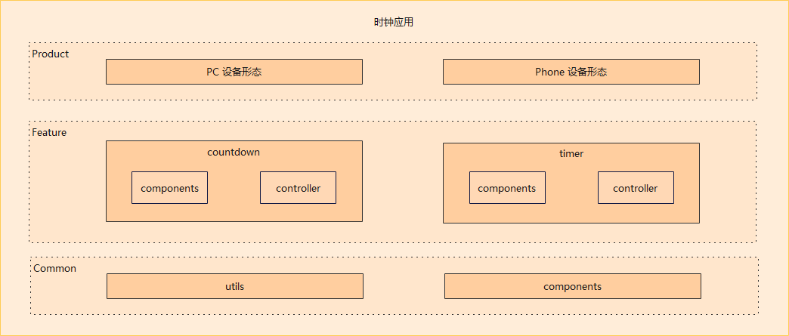
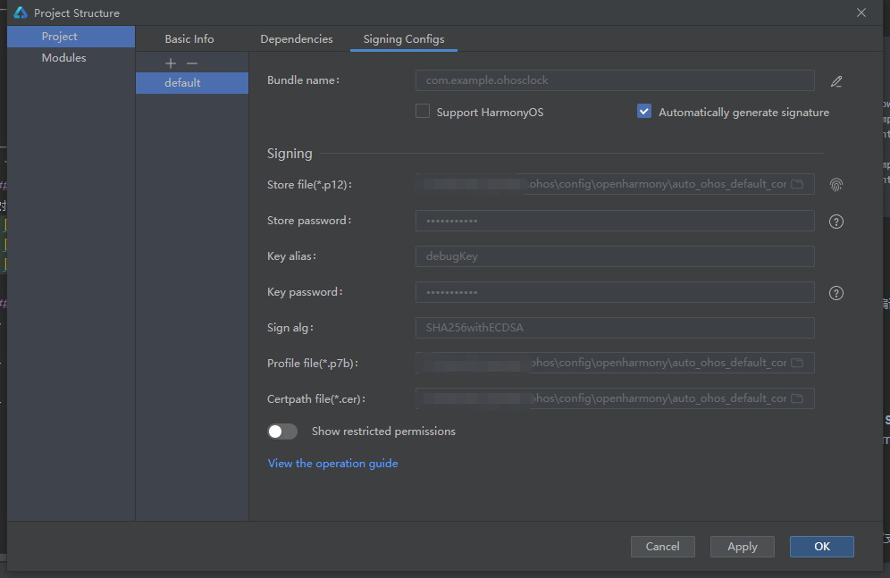
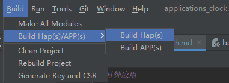
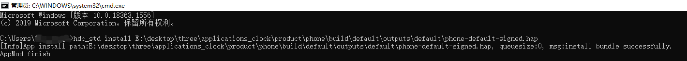

# 时钟应用

## 简介
时钟应用可以实现秒表计时功能和倒计时功能。
时钟应用采用扩展的TS语言（ArkTS）开发，主要的结构如下：

- **product**
  业务形态层：区分不同产品、不同屏幕的各形态应用，含有个性化业务，组件的配置，以及个性化资源包。（如区分tablet和default等设备形态，不同产品有不同的页面布局、手机配置无障碍语音资源等。）

- **feature**
  公共特性层：抽象的公共特性组件集合，可以被各应用形态引用，包含特性对应的UI封装组件和逻辑控制器。（如page页面文件、计时器的TimerPicker组件等。）

- **common**
  公共能力层：基础能力集，每个应用形态都必须依赖的模块，包含通用的UI封装组件，工具类和通用的资源包。（如添加闹钟按钮和添加世界时钟按钮、闹钟表盘和世界时钟表盘等。）

## 目录
### 目录结构
```
/clock/
├── common                    # 公共能力层目录
├── feature                   # 公共特性层目录
│   ├── countdown             # 倒计时功能目录
│   │   └── components        # 倒计时UI封装组件目录
│   │   └── controller        # 倒计时控制逻辑目录
│   └── timer                 # 秒表功能目录
│       └── components        # 秒表UI封装组件目录
│       └── controller        # 秒表控制逻辑目录
├── product                   # 业务形态层目录
```
## 安装
对应用完成签名，打包后，使用`hdc_std install "hap包地址"`命令进行安装。




## 约束
- 开发环境
  - **DevEco Studio for OpenHarmony**: 版本号大于3.0.0.992，下载安装OpenHarmony SDK API Version 9。（初始的IDE配置可以参考IDE的使用文档）
- 语言版本
  - ArkTS
- 限制
  - 本示例仅支持标准系统上运行
